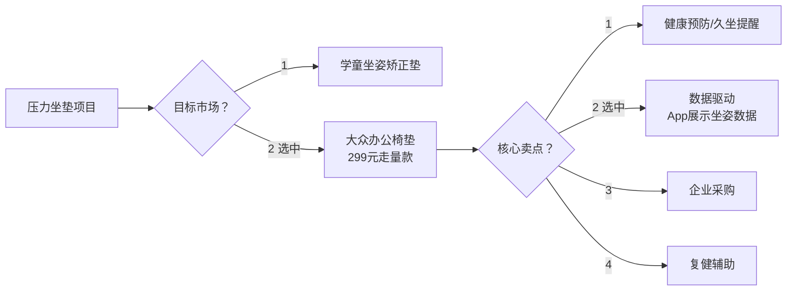

# 🎯 坐姿识别压力垫 V4 — 设计决策记录

> 基于 2026-05-19 Grill Me 的逐层追问，沉淀为产品化决策记录。

---

## 一、产品定位（决策树）



**最终定位：** 大众办公椅垫，299 元，**数据驱动型**坐姿分析产品

### 被舍弃的路径
| 备选方向 | 放弃原因 |
|---------|---------|
| 🚫 学童坐姿矫正垫 | 儿童产品合规壁垒高（3C、GB 6675 玩具安全、GB 31241 锂电池），合规成本吃掉利润 |
| 🚫 卷价格 | BOM 压不下来，299 已是底线 |
| 🚫 卷精度 | 专业级市场太小，复购率低 |
| 🚫 卷生态（开放 API） | 需要先有用户规模，不适合冷启动 |

---

## 二、硬件方案决策矩阵

### 2.1 传感器选型

| 方案 | 成本 | 精度 | 工艺难度 | 状态 |
|:----:|:----:|:----:|:--------:|:----:|
| FSR 压阻阵列（48 点） | ¥90 BOM | 8~10 种坐姿，85%+ | 中等 | ✅ **选中** |
| 电容式触控 | ¥200+ BOM | 高，但受湿度影响 | 高 | ❌ 成本过高 |
| IMU 纯倾斜 | ¥25 BOM | 5 种粗姿态 | 低 | ❌ 精度不够 |

**传感器布局：** 48 点 FSR，6×8 稀疏网格，覆盖坐骨结节重点区

### 2.2 主控选型

| 方案 | 成本 | ADC 通道 | BLE | 状态 |
|:----:|:----:|:--------:|:---:|:----:|
| ESP32 (WROOM-32) | ¥20~25 | 2 路（需 MUX） | 内置 | ✅ **选中** |
| STM32F103 + 外挂 BLE | ¥25~35 | 多路（无需 MUX） | 需外挂 | ❌ 成本更高、开发略复杂 |
| Arduino Nano | ¥15 | 6 路 | 无 | ✅ 已用于 v1，❌ V4 不够 |

### 2.3 多路复用方案（48 FSR → 2 ADC）

```
CD74HC4067 ×3 (16→1 MUX)
  共用 S0~S3 地址线 → ESP32 GPIO
  MUX#1 Y0~Y15 → 传感器 1~16 → SIG#1 → ADC1
  MUX#2 Y0~Y15 → 传感器 17~32 → SIG#2 → ADC2
  MUX#3 Y0~Y15 → 传感器 33~48 → SIG#3 → ADC3

ADC 噪声处理：软件移动平均滤波
采样频率：2~3 Hz（每通道），48 通道全扫 ≈ 200~300ms 一轮
```

### 2.4 供电与续航

| 方案 | 成本增量 | 用户体验 | 状态 |
|:----:|:--------:|:--------:|:----:|
| USB-C 充电，一天一充 | 0 | 一般 | ❌ |
| 1000mAh 电池，3~4 天一充 | +¥8~12 | 较好 | ❌ 仍需用户主动充 |
| **无线充电底座** | **+¥15~20** | **极佳，放上就充** | ✅ **选中** |

### 2.5 物理形态

| 问题 | 决策 |
|:----|:-----|
| 尺寸 | 45×45cm 大面积覆盖，软校准（首次使用 30s 学习基线） |
| 传感器嵌入 | 原型阶段：手焊 + 海绵挖槽 + 魔术贴 |
| 厚度目标 | ≤3cm |

---

## 三、算法路线

### 3.1 坐姿分类方案

```
硬规则兜底（基线）
   ├─ 左/右重心偏移 → 简单阈值
   ├─ 前/后重心偏移 → 简单阈值
   └─ 无人检测 → 全通道 < 阈值
                ↓
迁移学习（微调）
   48 点压力热图 → 轻量 CNN (TinyML/MobileNetV2)
   先在公开压力坐姿数据集预训练
   再用自采数据（500~1000 条）微调
```

**可识别坐姿（8~10 种）：**

| ID | 坐姿 | 检测方式 |
|:--:|:----:|:--------:|
| 0 | 🟢 正坐（标准） | 压力均匀 + 坐骨对称 |
| 1 | 🟡 前倾 | 前区 > 后区 + 阈值 |
| 2 | 🟡 后仰 | 后区 > 前区 + 阈值 |
| 3 | 🟡 左歪 | 左侧 > 右侧 + 阈值 |
| 4 | 🟡 右歪 | 右侧 > 左侧 + 阈值 |
| 5 | 🔵 跷二郎腿（左） | 左坐骨偏重 + 右下角≈0 |
| 6 | 🔵 跷二郎腿（右） | 右坐骨偏重 + 左下角≈0 |
| 7 | 🔵 扭坐（骨盆旋转） | ML 专属（硬规则难分） |
| 8 | ⚫ 离开 | 全通道 < 阈值 |

### 3.2 数据标注策略

**先观察再决策：**
1. 原型焊好 → 串口 CSV 输出 48 个压力值
2. 找 5~10 个不同体型的人试坐，记录真实压力分布
3. 分析不同坐姿的压力分布是否真正可分
4. 如果硬规则边界清晰 → 直接上硬规则 + 少量 ML 补充
5. 如果边界模糊 → 正式标注 500~1000 条数据做迁移学习微调

**标注格式：**
```csv
s1,s2,s3,...,s48,label
0.23,0.45,0.12,...,0.89,0
...
```
一行 ≈ 1KB，1000 条 ≈ 1MB

---

## 四、App 方案

| 层级 | 功能 | 开发周期 |
|:----:|:----|:--------:|
| **标准版** ✅ | 微信小程序 + 蓝牙连接 | 3~4 个月 |
| | 实时坐姿显示（8~10 种） | |
| | 今日数据概览 | |
| | 历史趋势图表 | |
| | 周报/月报 | |
| | 多设备支持 | |
| | 基础导出 | |
| 轻量版 ❌ | 只够 MVP | 不可作为最终产品 |
| 完整版 ❌ | AI 建议 / Apple Health 对接 / 企业管理后台 | 成本过高，先不做 |

---

## 五、原型计划（下一步行动）

### 阶段 1：焊原型 + 采数据（本周 ~ 两周）

**采购清单（~￥139）：**

| # | 品名 | 数量 | 参考价 | 搜索关键词 |
|:-:|------|:----:|:------:|:----------:|
| 1 | FSR 压阻传感器 20×20mm | 50片 | ¥50 | `薄膜压力传感器 FSR 20*20` |
| 2 | CD74HC4067 模拟复用器 | 5片 | ¥10 | `CD74HC4067 16路模拟开关` |
| 3 | ESP32 NodeMCU-32S | 2块 | ¥40 | `ESP32开发板 NodeMCU-32S` |
| 4 | 10kΩ 电阻 1/4W | 100只 | ¥5 | `10k电阻 1/4W 直插` |
| 5 | 104 电容 100nF | 20只 | ¥2 | `104电容 100nF` |
| 6 | 杜邦线 公母 20cm | 60根 | ¥10 | `杜邦线 公母 20cm` |
| 7 | 830孔面包板 | 2块 | ¥12 | `830孔面包板` |
| 8 | 排针 2.54 40P | 5条 | ¥5 | `排针 2.54 40P` |
| 9 | USB 数据线 | 1条 | ¥5 | 家里有可以省 |

**选配升级：**
| ADS1115 16位ADC模块 | ¥8~12/片 | ESP32 ADC 噪声过大时买 4 片顶替 |
| 逻辑分析仪 Saleae 仿品 | ¥25~35 | 调试 MUX 时序时用 |

### 阶段 2：环境搭建

**ESP32 开发环境（Arduino IDE）:**
```bash
# 1. 下载 Arduino IDE 2.x
#    https://www.arduino.cc/en/software

# 2. 添加 ESP32 开发板支持
#    文件 → 首选项 → 附加开发板管理器网址：
#    https://raw.githubusercontent.com/espressif/arduino-esp32/gh-pages/package_esp32_index.json

# 3. 安装 ESP32 支持包
#    工具 → 开发板 → 开发板管理器 → 搜索 "ESP32" → 安装

# 4. 选板
#    工具 → 开发板 → ESP32 Arduino → "NodeMCU-32S"

# 5. 验证
#    文件 → 示例 → ESP32 → Blink → 上传
```

### 阶段 3：固件开发（下步 TODO）

- [ ] 初始化 MUX → 轮询 48 通道 → 串口 CSV 输出
- [ ] 实现移动平均滤波
- [ ] 实现人坐检测唤醒/休眠
- [ ] 蓝牙 BLE 数据广播
- [ ] 实现硬规则坐姿分类基线

---

## 六、成本与价格模型

### BOM 估算（1000+ pcs 批量）

| 类别 | 成本 |
|:-----|:----:|
| 传感器阵列（48 FSR + MUX） | ~¥35 |
| MCU + 无线（ESP32 模块） | ~¥20 |
| 锂电池 + 无线充电线圈 | ~¥25 |
| PCB + 焊接 | ~¥15 |
| 坐垫棉体 + 织物封装 | ~¥15 |
| 包装 + 说明书 | ~¥5 |
| **BOM 总计** | **~¥115** |
| 代工组装 | ~¥15~20 |
| 出厂成本 | ~¥130~135 |
| **建议零售价** | **¥299** |
| 渠道/毛利 | ~55% |

对比 v1（6 传感器，¥42.6 BOM）：V4 成本翻 3 倍，但实现了：48 倍传感器密度、无线充电、BLE App 联动、10 倍坐姿精度。

---

## 七、关键风险与应对

| 风险 | 概率 | 影响 | 应对 |
|:----|:----:|:----:|:-----|
| 48 传感器压力分布不可分 | 中 | 高 | 先看数据再投 ML，硬规则兜底 |
| ESP32 ADC 噪声过大 | 高 | 中 | 软件滤波 → 不行就换 ADS1115 |
| 坐垫厚度/舒适度不达标 | 中 | 高 | 多轮打样验证海绵方案 |
| 无线充电效率低 | 中 | 中 | Qi 标准，线圈对准引导 |
| App 开发周期超预期 | 高 | 中 | 先做小程序 MVP，逐步迭代 |
| 299 定价市场接受度 | 中 | 高 | 对标竞品，强调数据价值 |

---

## 八、参考链接

- v1 基础版：[[坐姿识别压力垫-项目总览]]
- v1 硬件设计：[[坐姿识别压力垫-硬件设计]]
- v1 产品规格：[[坐姿识别压力垫-产品规格]]
- 工程源码：`D:\FW_Sourse\Autonomous_business_FW_Source\坐姿识别压力坐垫\`
